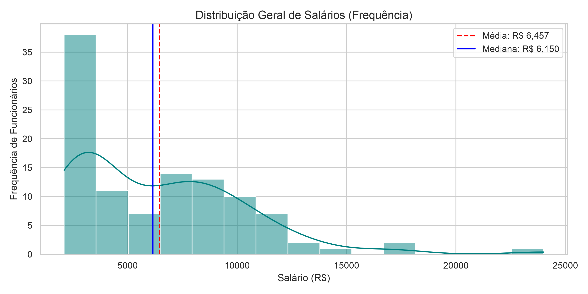
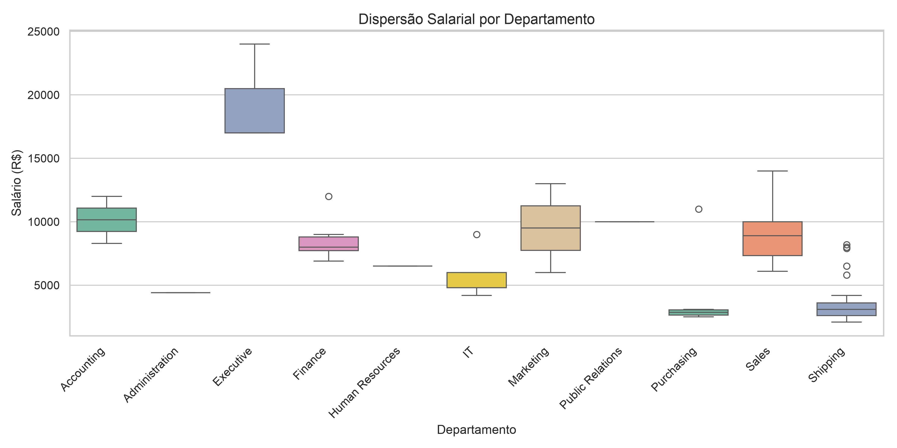
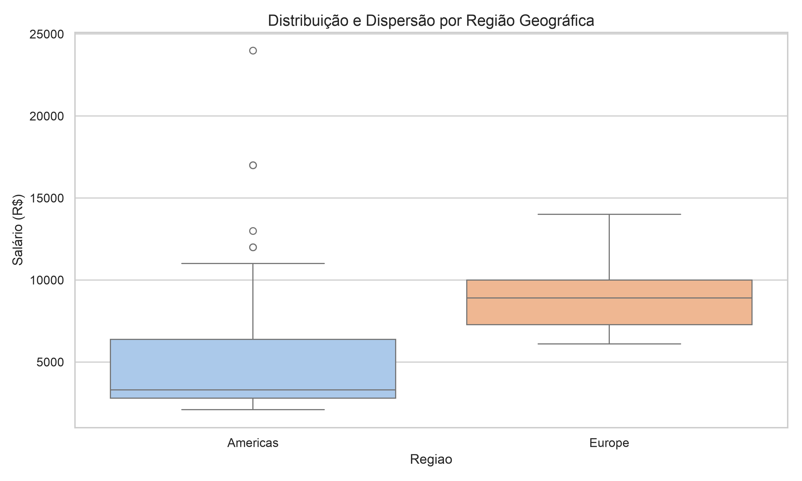

# Projeto Final: Análise Exploratória de Dados (EDA) de Recursos Humanos (HR)

Este projeto foi desenvolvido como parte prática do módulo de **Visualização de Dados e Business Intelligence** do programa **SCTEC/Senai**. O objetivo principal é extrair, modelar, analisar e visualizar dados relacionados à remuneração, cargos e distribuição geográfica dos colaboradores utilizando o banco de dados **FreeSQL** (esquema **Human Resources - HR**), **Python** e técnicas de **Estatística Descritiva** para apoiar tomadas de decisões estratégicas de Recursos Humanos.

---

## 👤 Identificação do Aluno
* **Nome Completo:** Daniel Roberto Cardoso
* **Curso:** Visualização de Dados e Business Intelligence
* **Turma:** T2

---

## 🎯 Objetivo do Trabalho
Subsidiar decisões estratégicas do departamento de Recursos Humanos através da identificação de padrões salariais, desigualdades regionais e análise de dispersão dos vencimentos entre os diferentes cargos e departamentos da organização.

A análise busca responder às seguintes perguntas de negócio:
1. Qual é a real distribuição e assimetria dos salários dentro da empresa?
2. Como se comportam os salários quando agrupados por diferentes departamentos?
3. Há discrepâncias significativas de remuneração entre as regiões geográficas onde a empresa atua?

---

## 🗄️ Descrição das Tabelas Usadas (Esquema HR)
Para este projeto, foram consultadas e relacionadas as seguintes tabelas do banco FreeSQL:
* **HR.EMPLOYEES:** Contém o registro principal dos colaboradores, incluindo nome, salário e datas de contratação.
* **HR.DEPARTMENTS:** Define os setores/departamentos da organização.
* **HR.JOBS:** Armazena os títulos dos cargos e os limites salariais (mínimo e máximo) permitidos para cada função.
* **HR.LOCATIONS:** Contém o endereço físico e a cidade de cada departamento.
* **HR.COUNTRIES:** Associa as localizações a seus respectivos países.
* **HR.REGIONS:** Identifica as grandes regiões continentais (ex: Americas, Europe).

### Dicionário de Dados do Esquema HR
| Tabela | Campo | Descrição |
| :--- | :--- | :--- |
| **HR.COUNTRIES** | `COUNTRY_ID` | Código do país |
| **HR.COUNTRIES** | `COUNTRY_NAME` | Nome do país |
| **HR.COUNTRIES** | `REGION_ID` | Código da região |
| **HR.DEPARTMENTS** | `DEPARTMENT_ID` | Código do departamento |
| **HR.DEPARTMENTS** | `DEPARTMENT_NAME` | Nome do departamento |
| **HR.DEPARTMENTS** | `MANAGER_ID` | Código do gerente responsável |
| **HR.DEPARTMENTS** | `LOCATION_ID` | Código do local do departamento |
| **HR.EMPLOYEES** | `EMPLOYEE_ID` | Código do funcionário |
| **HR.EMPLOYEES** | `FIRST_NAME` | Primeiro nome |
| **HR.EMPLOYEES** | `LAST_NAME` | Sobrenome |
| **HR.EMPLOYEES** | `EMAIL` | E-mail do funcionário |
| **HR.EMPLOYEES** | `PHONE_NUMBER` | Telefone |
| **HR.EMPLOYEES** | `HIRE_DATE` | Data de contratação |
| **HR.EMPLOYEES** | `JOB_ID` | Código do cargo |
| **HR.EMPLOYEES** | `SALARY` | Salário |
| **HR.EMPLOYEES** | `COMMISSION_PCT` | Percentual de comissão |
| **HR.EMPLOYEES** | `MANAGER_ID` | Código do gestor |
| **HR.EMPLOYEES** | `DEPARTMENT_ID` | Código do departamento |
| **HR.JOBS** | `JOB_ID` | Código do cargo |
| **HR.JOBS** | `JOB_TITLE` | Nome do cargo |
| **HR.JOBS** | `MIN_SALARY` | Salário mínimo do cargo |
| **HR.JOBS** | `MAX_SALARY` | Salário máximo do cargo |
| **HR.LOCATIONS** | `LOCATION_ID` | Código do local |
| **HR.LOCATIONS** | `STREET_ADDRESS` | Endereço |
| **HR.LOCATIONS** | `POSTAL_CODE` | CEP |
| **HR.LOCATIONS** | `CITY` | Cidade |
| **HR.LOCATIONS** | `STATE_PROVINCE` | Estado ou província |
| **HR.REGIONS** | `REGION_ID` | Código da região |
| **HR.REGIONS** | `REGION_NAME` | Nome da região |

---

## 💾 Consultas SQL Desenvolvidas
Foram estruturadas duas queries utilizando múltiplos relacionamentos (`LEFT JOIN`) e filtros (`WHERE`) para gerar as bases analíticas exportadas para os arquivos `.csv`.

### 🔍 Query 1: Salários por Departamento e Cargo (`query_01.sql`)
Focada em mapear os vencimentos de cada funcionário frente aos limites de seu respectivo cargo e setor.

```sql
SELECT
    e.EMPLOYEE_ID AS funcionario_id,
    CONCAT(e.FIRST_NAME, ' ', e.LAST_NAME) AS nome_completo,
    e.HIRE_DATE AS data_contratacao,
    e.SALARY AS salario,
    d.DEPARTMENT_NAME AS departamento,
    j.JOB_TITLE AS cargo,
    j.MIN_SALARY AS salario_min_cargo,
    j.MAX_SALARY AS salario_max_cargo
FROM
    HR.EMPLOYEES e
LEFT JOIN
    HR.DEPARTMENTS d ON e.DEPARTMENT_ID = d.DEPARTMENT_ID
LEFT JOIN
    HR.JOBS j ON e.JOB_ID = j.JOB_ID
WHERE
    e.DEPARTMENT_ID IS NOT NULL
    AND e.SALARY IS NOT NULL
ORDER BY
    d.DEPARTMENT_NAME ASC,
    e.SALARY DESC;
```

### 🔍 Query 2: Funcionários por Região (`query_02.sql`)
Focada em consolidar a localização geográfica do colaborador para estudos de distribuição regional.
```sql
SELECT
    e.EMPLOYEE_ID AS funcionario_id,
    CONCAT(e.FIRST_NAME, ' ', e.LAST_NAME) AS nome_completo,
    e.HIRE_DATE AS data_contratacao,
    e.SALARY AS salario,
    d.DEPARTMENT_NAME AS departamento,
    l.CITY AS cidade,
    l.STATE_PROVINCE AS estado_provincia,
    c.COUNTRY_NAME AS pais,
    r.REGION_NAME AS regiao
FROM
    HR.EMPLOYEES e
LEFT JOIN
    HR.DEPARTMENTS d ON e.DEPARTMENT_ID = d.DEPARTMENT_ID
LEFT JOIN
    HR.LOCATIONS l ON d.LOCATION_ID = l.LOCATION_ID
LEFT JOIN
    HR.COUNTRIES c ON l.COUNTRY_ID = c.COUNTRY_ID
LEFT JOIN
    HR.REGIONS r ON c.REGION_ID = r.REGION_ID
WHERE
    r.REGION_NAME IS NOT NULL
ORDER BY
    r.REGION_NAME ASC,
    c.COUNTRY_NAME ASC,
    l.CITY ASC;
```

### 📈 Análise Exploratória de Dados (Estatística Descritiva)
Abaixo estão consolidadas as métricas descritivas obtidas a partir da execução do script projeto_final.py sobre as bases extraídas.  

## 📊 Estatísticas Gerais de Salários
• Total de Funcionários Analisados: 106 colaboradores
• Média Salarial: R$ 6.456,75
• Mediana Salarial: R$ 6.150,00
• Salário Mínimo: R$ 2.100,00
• Salário Máximo: R$ 24.000,00
• Desvio Padrão: R$ 3.927,80

## 🏢 Visão Setorial: Salários por Departamento
| Departamento | Contagem (Qtd) | Média (R$) | Mediana (R$) | Mínimo (R$) | Máximo (R$) |
| :--- | :--- | :--- | :--- | :---: | :---: |
| **Accounting** | 2 | 10.154,00 | 10.154,00 | 8.300,00 | 12.008,00 |
| **Administration** | 1 | 4.400,00 | 4.400,00 | 4.400,00 | 4.400,00 |
| **Executive** | 3 | 19.333,33 | 17.000,00 | 17.000,00 | 24.000,00 |
| **Finance** | 6 | 8.601,33 | 8.000,00 | 6.900,00 | 12.008,00 |
| **Human Resources** | 1 | 6.500,00 | 6.500,00 | 6.500,00 | 6.500,00 |
| **IT** | 5 | 5.760,00 | 4.800,00 | 4.200,00 | 9.000,00 |
| **Marketing** | 2 | 9.500,00 | 9.500,00 | 6.000,00 | 13.000,00 |
| **Public Relations** | 1 | 10.000,00 | 10.000,00 | 10.000,00 | 10.000,00 |
| **Purchasing** | 6 | 4.150,00 | 2.850,00 | 2.500,00 | 11.000,00 |
| **Sales** | 34 | 8.955,88 | 8.900,00 | 6.100,00 | 14.000,00 |
| **Shipping** | 45 | 3.475,56 | 3.100,00 | 2.100,00 | 8.200,00 |

## 🎨 Visualizações Gráficas

### 1. Distribuição Geral de Salários (Histograma)
O histograma apresenta uma assimetria positiva (à direita). Isso mostra que a maior parte do corpo de colaboradores está concentrada nas faixas salariais operacionais de base (principalmente abaixo de R$ 5.000,00), enquanto apenas uma minoria (níveis gerenciais e presidência) recebe salários elevados.



### 2. Dispersão Salarial por Departamento (Boxplot)
Permite visualizar as assimetrias e amplitudes internas de remuneração em cada área. O setor **Executive** desponta com a faixa mais elevada, enquanto os setores de **Shipping** (Expedição) e **Purchasing** concentram o maior número de trabalhadores em faixas de remuneração mais baixas. Observa-se a presença de outliers (valores fora do padrão) em setores como IT, Purchasing, Finance e Shipping.



### 3. Distribuição e Dispersão por Região Geográfica (Boxplot)
Demonstra que, embora a região das **Americas** contenha os maiores salários absolutos devido à presidência corporativa (visível pelos outliers superiores), a região **Europe** apresenta uma média e mediana salarial significativamente superiores e um comportamento de dados mais concentrado e homogêneo em patamares elevados.


### 💡 Principais Insights de Negócio
### 1. Distorção Oculta por Métricas Simples: 
A proximidade entre a Média (R$ 6.456,75) e a Mediana (R$ 6.150,00) pode dar a falsa impressão de uma distribuição de renda equilibrada. O histograma revela que o grosso da força operacional recebe menos que a média geral, sustentada pelas remunerações executivas muito elevadas.

### 2. Abismo Regional de Piso: 
O salário mínimo praticado na Europa (R$ 6.100,00) é quase três vezes maior que o menor salário praticado nas Américas (R$ 2.100,00). Esta discrepância sugere a necessidade de auditar as funções exercidas em cada polo ou entender o impacto cambial e do custo de vida nessas praças.

### 3. Análise de Outliers Operacionais: 
Colaboradores em setores de base, como Shipping, que figuram como outliers superiores (acima da barreira de R$ 5.000,00) podem ser líderes de equipe, supervisores ou pessoal altamente especializado cujo cargo necessita de readequação de nomenclatura para não gerar distorções de isonomia.

---

## 🛠️ Como Executar o Projeto

1. **Clone o repositório:**
   ```bash
   git clone [https://github.com/DanielMusashi79/projeto_final_HR.git](https://github.com/DanielMusashi79/projeto_final_HR.git)
   cd turma-visualizacao-de-dados

2. **Certifique-se de possuir as dependências instaladas:**
pip install pandas matplotlib seaborn

3. **Coloque os arquivos extraídos do banco de dados na raiz da pasta:**
• `query_01.csv`
• `query_02.csv`

4. Execute o script de análise em Python para processar os dados e gerar os gráficos:
`python projeto_final.py`

5. Verifique os gráficos exportados:
Os arquivos `grafico_01_histograma_salarios.png`, `grafico_02_boxplot_departamento.png` e `grafico_03_boxplot_regiao.png` serão salvos automaticamente em alta resolução na pasta do projeto.

### 🚀 Sugestões de Melhorias Futuras
### • Conexão Direta (Pipeline ETL): 
 Substituir a importação manual de planilhas CSV por uma conexão direta do script Python ao banco de dados utilizando bibliotecas de persistência como o SQLAlchemy ou pymysql.

### • Análise de Correlação de Carreira: 
Cruzar o salário com o tempo de casa (HIRE_DATE) dos colaboradores para verificar se o crescimento salarial está intimamente relacionado com o tempo de serviço.

### • Dashboard Interativo: 
Exportar os dados e visualizações consolidadas para uma ferramenta auto-serviço (como o Power BI) ou criar um app web interativo utilizando a biblioteca Streamlit.